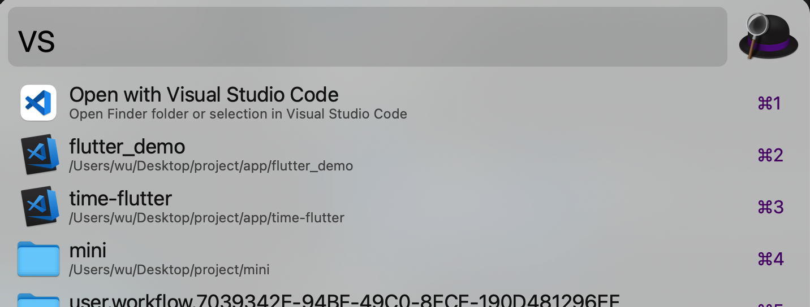

# alfred-vscode

> alfred工作流，使用vscode打开选中文件，支持历史文件、[Project Manager](https://marketplace.visualstudio.com/items?itemName=alefragnani.project-manager)配置的项目、当前finder选中文件，搜索文件以及远程文件

> 这个工作流很大部分是基于[alfred-vscode](https://github.com/kbshl/alfred-vscode)和[alfred-open-with-vscode-workflow](https://github.com/alexchantastic/alfred-open-with-vscode-workflow)整合的，在基础上增加了vscode历史文件查询



## 前提条件

必备：

- [Node.js 14+](https://nodejs.org) - 低版本没测试过，不保证
- [Alfred 4 or later ](https://www.alfredapp.com) - 低版本没测试过，不保证

可选：

- [Visual Studio Code Project Manager](https://marketplace.visualstudio.com/items?itemName=alefragnani.project-manager) - 配置的项目会优先展示在历史项目前面
- [code](https://code.visualstudio.com/docs/setup/mac) - vscode的命令工具，用于支持打开远程文件
  
  ## 安装

```bash
npm install --global @yjrhgvbn/alfred-vscode
```

## 使用

### vs

1. 输入`vs`，按下`空格`，第一个选项是按下回车即可打开当前finder选中的文件
2. 后面的选项是[Project Manager](https://marketplace.visualstudio.com/items?itemName=alefragnani.project-manager)的配置项目和vscode历史文件，按下回车即可在vscode打开，按住`command`在Finder打开，按住`option`在终端打开。
3. 继续输入会过滤项目和文件，操作与第二相同。

### vsf

1. 输入`vsf`，按下`空格`，输入容易文件名，会查询系统全部文件，按下回车即可在vscode打开，按住`command`在Finder打开，按住`option`在终端打开。

## 参考

[alfred-vscode](https://github.com/kbshl/alfred-vscode)

[alfred-open-with-vscode-workflow](https://github.com/alexchantastic/alfred-open-with-vscode-workflow)
